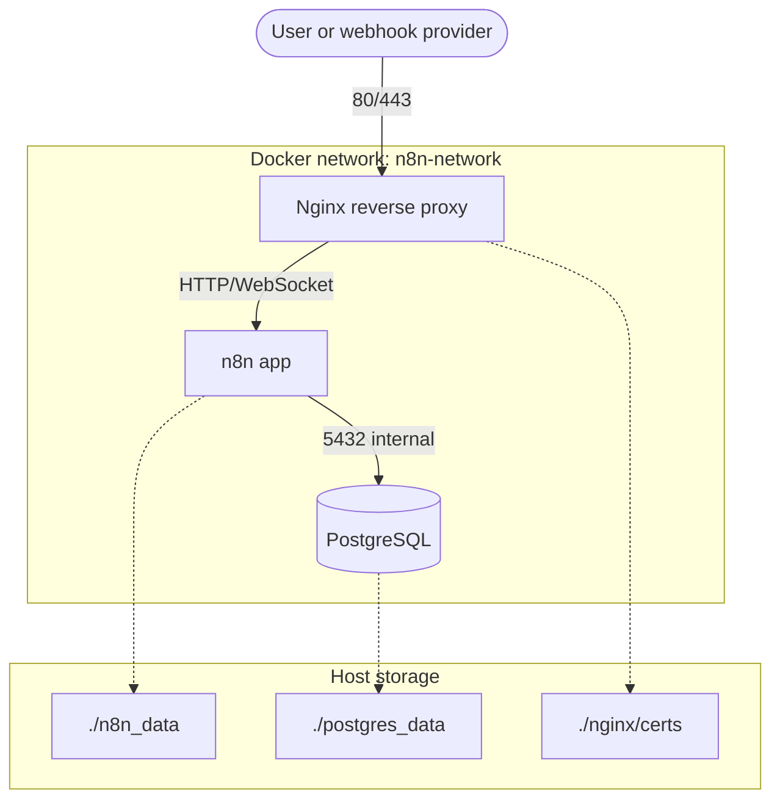

# n8n Automation Stack for Rocky Linux

এই repository-তে n8n, PostgreSQL এবং Nginx reverse proxy একসাথে Docker Compose দিয়ে চালানোর production-ready setup রাখা হয়েছে। Rocky Linux server-এ host Node.js install করার প্রয়োজন নেই; n8n Docker image নিজের Node.js runtime নিয়েই চলে।

## Rocky Linux readiness

এই stack এখন Rocky Linux server-এ deploy করার জন্য প্রস্তুত:

- Docker Engine এবং Docker Compose plugin দিয়ে পুরো app চালানো হয়।
- Host machine-এ Node.js দরকার নেই।
- PostgreSQL data এবং n8n config bind mount হিসেবে রাখা হয়, তাই backup নেওয়া সহজ।
- Rocky Linux-এর SELinux-enabled host-এর জন্য bind mount-এ `:Z` label ব্যবহার করা হয়েছে।
- n8n reverse proxy mode-এর জন্য `WEBHOOK_URL`, `N8N_EDITOR_BASE_URL`, `N8N_PROXY_HOPS` এবং Nginx forwarded headers configured আছে।
- HTTP দিয়ে smoke test এবং HTTPS production setup দুই পথই document করা আছে।

## Stack overview

| Service | Image | Purpose |
| --- | --- | --- |
| `nginx` | `nginx:1.25-alpine` | Public HTTP/HTTPS entrypoint এবং reverse proxy |
| `n8n` | `docker.n8n.io/n8nio/n8n:latest` | Workflow automation app |
| `postgres` | `postgres:16-alpine` | n8n database |

Only Nginx exposes host ports `80` and `443`. n8n port `5678` and PostgreSQL port `5432` stay inside the private Docker network.

## Directory structure

```text
n8n_automation/
|-- docker-compose.yml
|-- .env.example
|-- .env                  # active server config, git-ignored
|-- nginx/
|   |-- default.conf
|   `-- certs/            # copied Let's Encrypt certs, git-ignored
|-- n8n_data/             # n8n config and encryption metadata, git-ignored
`-- postgres_data/        # PostgreSQL database files, git-ignored
```

## Architecture



## Fresh Rocky Linux server setup

Assumptions:

- You have a Rocky Linux server with a sudo user.
- Docker and Node.js are not installed yet.
- For public HTTPS, your domain or subdomain already points to the server IP.
- Your cloud/VPS firewall also allows inbound TCP `80` and `443`.

### 1. Update server and install base tools

```bash
sudo dnf -y update
sudo dnf -y install git nano openssl firewalld dnf-plugins-core
sudo systemctl enable --now firewalld
```

Open HTTP and HTTPS in the server firewall:

```bash
sudo firewall-cmd --permanent --add-service=http
sudo firewall-cmd --permanent --add-service=https
sudo firewall-cmd --reload
```

### 2. Install Docker Engine and Compose plugin

```bash
sudo dnf config-manager --add-repo https://download.docker.com/linux/rhel/docker-ce.repo
sudo dnf -y install docker-ce docker-ce-cli containerd.io docker-buildx-plugin docker-compose-plugin
sudo systemctl enable --now docker
```

Verify Docker:

```bash
sudo docker run --rm hello-world
docker --version
docker compose version
```

Optional: allow your current user to run Docker without `sudo`.

```bash
sudo usermod -aG docker "$USER"
newgrp docker
```

The `docker` group can control the Docker daemon, so only trusted admin users should be added to it. If you skip this step, prefix Docker commands with `sudo`.

### 3. Put this repository on the server

Use whichever method matches your workflow. A common path is `/opt/n8n_automation`.

```bash
sudo mkdir -p /opt/n8n_automation
sudo chown "$USER":"$USER" /opt/n8n_automation
git clone <your-repository-url> /opt/n8n_automation
cd /opt/n8n_automation
```

If you upload the project manually instead of cloning, make sure the final server path contains `docker-compose.yml`, `.env.example`, and `nginx/default.conf`.

### 4. Create and edit `.env`

```bash
cp .env.example .env
nano .env
```

Generate strong secrets:

```bash
openssl rand -hex 32
openssl rand -hex 32
```

Use the generated values in:

```env
N8N_ENCRYPTION_KEY=<first_generated_value>
N8N_USER_MANAGEMENT_JWT_SECRET=<second_generated_value>
POSTGRES_PASSWORD=<another_strong_password>
```

For a public HTTPS server, set these values:

```env
DOMAIN_NAME=n8n.example.com
N8N_PROTOCOL=https
WEBHOOK_URL=https://n8n.example.com/
N8N_EDITOR_BASE_URL=https://n8n.example.com/
N8N_PROXY_HOPS=1
TZ=Asia/Dhaka
GENERIC_TIMEZONE=Asia/Dhaka
HOST_HTTP_PORT=80
HOST_HTTPS_PORT=443
```

For a temporary HTTP smoke test before SSL:

```env
DOMAIN_NAME=<server-ip-or-domain>
N8N_PROTOCOL=http
WEBHOOK_URL=http://<server-ip-or-domain>/
N8N_EDITOR_BASE_URL=http://<server-ip-or-domain>/
N8N_PROXY_HOPS=1
```

Important: `WEBHOOK_URL` and `N8N_EDITOR_BASE_URL` must end with `/`.

### 5. Prepare persistent folders and permissions

```bash
mkdir -p n8n_data postgres_data nginx/certs backups
sudo chown -R 1000:1000 n8n_data
sudo chown -R 70:70 postgres_data
```

Why these IDs:

- n8n runs as the `node` user, commonly UID/GID `1000`.
- `postgres:16-alpine` uses the Alpine `postgres` user, UID/GID `70`.
- SELinux relabeling is handled by the `:Z` suffix in `docker-compose.yml`.

### 6. Start the stack

```bash
docker compose pull
docker compose up -d
docker compose ps
```

Check logs:

```bash
docker compose logs -f n8n
docker compose logs -f postgres
docker compose logs -f nginx
```

For HTTP smoke test, open:

```text
http://<server-ip-or-domain>/
```

For production, continue with HTTPS.

## HTTPS with Let's Encrypt

### 1. Install Certbot

```bash
sudo dnf -y install epel-release
sudo dnf -y install certbot
```

### 2. Issue certificate

Port `80` must be free while using the standalone challenge. If the stack is already running, stop only Nginx:

```bash
docker compose stop nginx
```

Set your real domain and request the certificate:

```bash
DOMAIN=n8n.example.com
sudo certbot certonly --standalone -d "$DOMAIN"
```

### 3. Copy certificates into this project

The compose file mounts `./nginx/certs` into the Nginx container as `/etc/letsencrypt`.

```bash
DOMAIN=n8n.example.com
mkdir -p "nginx/certs/live/$DOMAIN"
sudo cp -L "/etc/letsencrypt/live/$DOMAIN/fullchain.pem" "nginx/certs/live/$DOMAIN/fullchain.pem"
sudo cp -L "/etc/letsencrypt/live/$DOMAIN/privkey.pem" "nginx/certs/live/$DOMAIN/privkey.pem"
sudo chown -R root:root nginx/certs
sudo chmod -R go-rwx nginx/certs
```

### 4. Enable HTTPS in Nginx

Edit `nginx/default.conf`:

```bash
nano nginx/default.conf
```

Do these changes:

- Replace every `n8n.yourdomain.com` with your real domain.
- Uncomment the full `server { ... }` block for port `443`.
- In the port `80` server block, keep only one `location /` block.
- For HTTPS-only production, uncomment the redirect block and comment out the default HTTP proxy `location /` block.

Then make sure `.env` also uses HTTPS:

```env
DOMAIN_NAME=n8n.example.com
N8N_PROTOCOL=https
WEBHOOK_URL=https://n8n.example.com/
N8N_EDITOR_BASE_URL=https://n8n.example.com/
```

Restart:

```bash
docker compose up -d
docker compose ps
```

Open:

```text
https://n8n.example.com/
```

### 5. Renew certificates

Test renewal:

```bash
sudo certbot renew --dry-run
```

After a real renewal, copy the new cert files into `nginx/certs` again and reload Nginx:

```bash
DOMAIN=n8n.example.com
sudo cp -L "/etc/letsencrypt/live/$DOMAIN/fullchain.pem" "nginx/certs/live/$DOMAIN/fullchain.pem"
sudo cp -L "/etc/letsencrypt/live/$DOMAIN/privkey.pem" "nginx/certs/live/$DOMAIN/privkey.pem"
docker compose exec nginx nginx -s reload
```

## Host Node.js

Do not install Node.js on the Rocky Linux host for this deployment. This repository has no `package.json`, no local Node build step, and no host-side n8n process. Node.js is inside the n8n Docker image.

If you later add custom native modules or custom nodes that require build tooling, create a custom n8n Docker image instead of installing Node.js directly on the server.

## Common operations

Start:

```bash
docker compose up -d
```

Stop:

```bash
docker compose down
```

Restart one service:

```bash
docker compose restart n8n
docker compose restart nginx
```

Show status:

```bash
docker compose ps
```

Follow logs:

```bash
docker compose logs -f
```

## Backup and restore

Create a backup directory:

```bash
mkdir -p backups
```

### PostgreSQL backup

```bash
docker compose exec -T postgres sh -c 'pg_dump -U "$POSTGRES_USER" -d "$POSTGRES_DB" -F c' > "backups/postgres_$(date +%F_%H%M).dump"
```

### n8n data and environment backup

```bash
tar -czf "backups/n8n_data_$(date +%F_%H%M).tar.gz" n8n_data
cp .env "backups/env_$(date +%F_%H%M).backup"
```

Keep `.env` and `N8N_ENCRYPTION_KEY` safe. Without the original encryption key, restored n8n credentials cannot be decrypted.

### Restore PostgreSQL backup

Stop n8n while restoring:

```bash
docker compose stop n8n
docker compose cp backups/postgres_BACKUP_FILE.dump postgres:/tmp/restore.dump
docker compose exec -T postgres sh -c 'pg_restore -U "$POSTGRES_USER" -d "$POSTGRES_DB" --clean --if-exists --verbose /tmp/restore.dump'
docker compose start n8n
```

Replace `postgres_BACKUP_FILE.dump` with the real backup file name.

## Update

Take a backup first, then update images:

```bash
docker compose pull
docker compose up -d --remove-orphans
docker image prune -f
docker compose ps
```

Check n8n after updating:

```bash
docker compose logs --tail=100 n8n
```

## Troubleshooting

### `docker compose` command not found

Install the Compose plugin:

```bash
sudo dnf -y install docker-compose-plugin
docker compose version
```

### Permission denied on `n8n_data`

```bash
sudo chown -R 1000:1000 n8n_data
docker compose restart n8n
```

### Permission denied on `postgres_data`

```bash
sudo chown -R 70:70 postgres_data
docker compose restart postgres
```

### SELinux blocks mounted files

The compose file already uses `:Z` on bind mounts. Recreate the containers so Docker can relabel the paths:

```bash
docker compose down
docker compose up -d
```

### Port 80 or 443 already in use

Find the process:

```bash
sudo ss -tulpn | grep -E ':80|:443'
```

Stop the conflicting service or change these values in `.env`:

```env
HOST_HTTP_PORT=8080
HOST_HTTPS_PORT=8443
```

### Webhook URL is wrong or includes port `5678`

Check `.env`:

```env
N8N_PROTOCOL=https
DOMAIN_NAME=n8n.example.com
WEBHOOK_URL=https://n8n.example.com/
N8N_EDITOR_BASE_URL=https://n8n.example.com/
N8N_PROXY_HOPS=1
```

Then restart n8n:

```bash
docker compose restart n8n
```

### HTTPS Nginx config fails

Check syntax even if the Nginx container is not running:

```bash
docker compose run --rm --no-deps nginx nginx -t
```

Common causes:

- The HTTPS block is uncommented before certificate files exist.
- `n8n.yourdomain.com` was not replaced with the real domain.
- The HTTP server block has two active `location /` blocks.

## References

- Rocky Linux Docker Engine documentation: https://docs.rockylinux.org/gemstones/containers/docker/
- Docker Compose plugin documentation: https://docs.docker.com/compose/install/linux/
- n8n Docker Compose documentation: https://docs.n8n.io/hosting/installation/server-setups/docker-compose/
- n8n reverse proxy webhook documentation: https://docs.n8n.io/hosting/configuration/configuration-examples/webhook-url/
- PostgreSQL Alpine image UID/GID source: https://raw.githubusercontent.com/docker-library/postgres/master/Dockerfile-alpine.template
